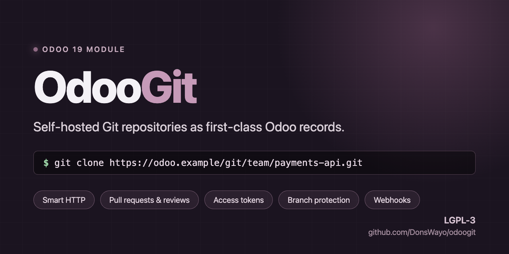
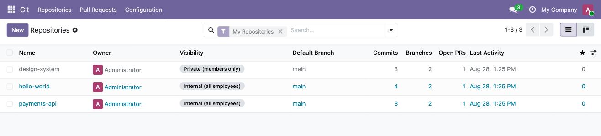
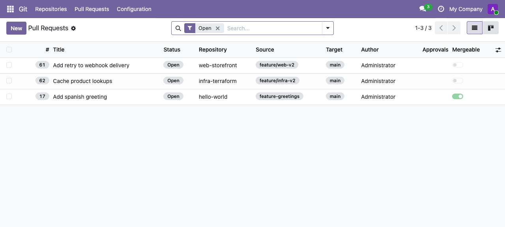
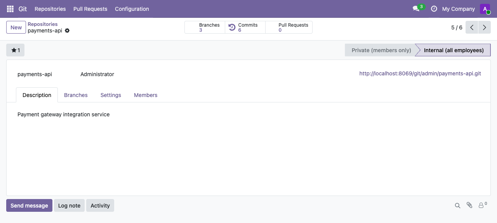
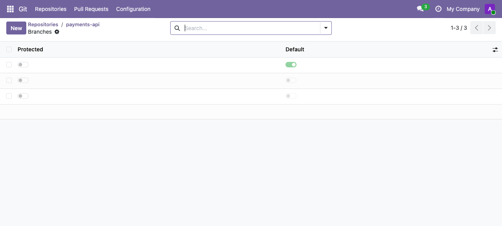
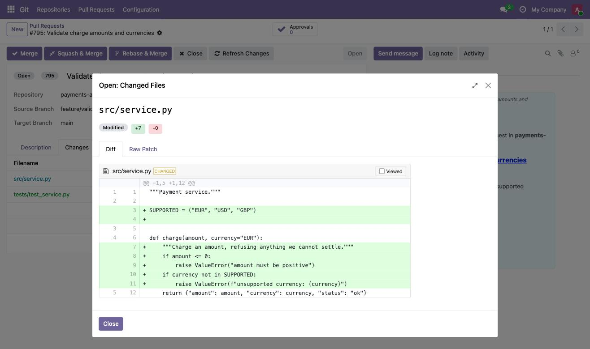
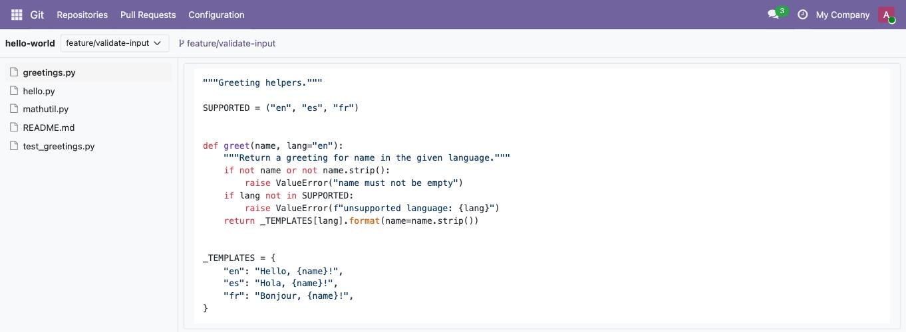

<p align="center">
  
</p>

<h1 align="center">odoo-addons</h1>

<p align="center"><i>Odoo 19 modules by DonsWayo. One folder per module.</i></p>

| Module | What it does | Version |
|---|---|---|
| [`dw_git`](dw_git/) | **Git Hosting** — Git repository hosting inside Odoo, documented below | [19.0.1.5.0](https://apps.odoo.com/apps/modules/19.0/dw_git) |

---

<h1 align="center">Git Hosting</h1>

<p align="center">
  <strong>Git repository hosting inside Odoo 19.</strong><br>
  Self-hosted repositories as first-class Odoo records — real bare repos on
  disk, served over Git Smart HTTP, with pull requests, reviews, access tokens
  and webhooks wired into Odoo's own users, groups and record rules.<br>
  <code>git clone</code>, <code>git push</code> and <code>git fetch</code> talk
  straight to them through <code>git http-backend</code>.
</p>

<p align="center">
  <a href="https://github.com/DonsWayo/odoo-addons/actions/workflows/ci.yml"></a>
  <a href="https://github.com/DonsWayo/odoo-addons/releases/latest"></a>
  <a href="LICENSE"></a>
  
  
  
</p>

<p align="center">
  <a href="#what-it-does">Features</a> ·
  <a href="#install-docker">Install</a> ·
  <a href="#cloning-and-pushing">Clone &amp; push</a> ·
  <a href="#permissions">Permissions</a> ·
  <a href="#testing">Testing</a> ·
  <a href="docs/LIMITATIONS.md">Limitations</a> ·
  <a href="CONTRIBUTING.md">Contributing</a>
</p>

---

> **Status:** working, self-hosted, single-node. Read
> [docs/LIMITATIONS.md](docs/LIMITATIONS.md) before deploying — notably
> **webhooks are recorded but never delivered**, there is **no SSH
> transport**, and branch protection is enforced on Odoo-side merges only, not
> on `git push`.

## What it does

| Area | Supported |
|---|---|
| **Repositories** | `private` (members only) and `internal` (all employees) visibility, owner + member + group access, stars, per-owner namespacing (`<owner>/<name>.git`) |
| **Git transport** | Smart HTTP clone / fetch / push via `git http-backend`, Basic-auth with Personal Access Tokens, proper `401 WWW-Authenticate` challenges |
| **Branches** | synced from the bare repo on every push, ahead/behind counters, protection settings (see limitations), default-branch tracking |
| **Commits** | last 50 per branch mirrored into Odoo on push — SHA, author, message, date |
| **Pull requests** | draft → open → merged/closed, merge / squash / rebase, conflict detection, merges performed with `merge-tree` + `commit-tree` so they work on bare repos |
| **Reviews** | approve / request changes / comment, approval counting against the target branch's required count; a "request changes" blocks the merge |
| **Tokens** | PATs and deploy keys stored **only** as SHA-256 hashes, with scopes and expiry; the raw secret is shown once and never persisted |
| **Webhooks** | payload construction and HMAC-SHA256 signing, delivery records — **not delivered**, see limitations |
| **Code browsing** | read-only file browser — branch selector, directory-at-a-time tree, syntax-highlighted file contents |
| **Diffs** | pull request diffs rendered as a real coloured diff with syntax highlighting, plus the raw unified patch |
| **Notifications** | mail on PR created / review requested / merged / closed, and a to-do activity for each newly requested reviewer |
| **Portal** | repository, commit and pull request pages — see [Two interfaces](#two-interfaces) for who these are for |
| **JSON-RPC API** | repositories, branches, commits, tree, blob, pull requests, reviews |
| **Translations** | `i18n/dw_git.pot` template, regenerated with `make i18n` |

Not included: issues, wiki, labels, forks, SSH.

## Two interfaces

The module ships **two** separate UIs. They look nothing alike, which is
expected — they serve different people.

| | Backend | Portal |
|---|---|---|
| URL | `/odoo/…` — the **Git** app | `/git/<owner>/<repo>` |
| Audience | internal employees | portal users, who have no backend access |
| Look | standard Odoo backend | website theme (site logo, site footer) |
| Reached from | the Git app menu | links in notification emails |

Notification emails do **not** hardcode either one. They link through
`_notify_get_action_link('view')`, Odoo's own redirector, which resolves per
recipient: an employee lands on the backend record, a portal user on the
portal page. One link, right destination.

> **Caveat.** The portal is not currently reachable in practice:
> `member_ids` is restricted to internal users and no portal access rules
> ship with the module, so no portal user can legitimately be given a
> repository. The pages render, but the audience cannot be created. Tracked
> in [#21](https://github.com/DonsWayo/odoo-addons/issues/21) — the decision
> is whether to grant portal access properly or drop the portal.

## Screenshots

|  |  |
|---|---|
|  |  |
| **Repositories** — branches, commits, open PRs and last activity at a glance | **Pull requests** — source and target branch, author, approvals, mergeable state |
|  |  |
| **Repository** — clone URL, counters, members and full Odoo chatter | **Branches** — synced from the bare repo, with protection settings |
|  |  |
| **Diff** — real unified diffs computed against the merge base, rendered with syntax highlighting | **Browse files** — pick a branch, walk the tree, read any file at that ref |

## Install (Docker)

```bash
git clone https://github.com/DonsWayo/odoo-addons.git
cd odoo-addons
make build up install
```

Log in at http://localhost:8069 — `admin` / `admin`. `make help` lists every
target; `make versions` prints what is actually running.

Stack: Odoo 19 · PostgreSQL 18 · GitPython 3.1.59 · mailpit (local mail).

### Try it with real data

```bash
make seed                    # 3 repositories with real git history
DW_GIT_RESET=1 make seed     # ...rebuilt from scratch
```

Every repository this creates is a **real bare git repository on disk** with
real commits and branches, and its pull requests get their diffs through the
same code path a `git push` uses. That distinction matters: a repository
record with no git repository behind it shows changed files with line counts
and an empty diff — the UI describing a history that was never pushed. If a
diff does not render after seeding, that is a bug and not a gap in the
fixture.

### Reading the notification emails

Odoo queues mail and delivers nothing without an SMTP server, so
notifications are invisible by default. The stack runs
[mailpit](https://mailpit.axllent.org/), which catches every outgoing message
instead of sending it:

```bash
make mail          # list what has been sent, with a link to the mailbox
make mail-clear    # empty it
```

Open **http://localhost:8025** to read the actual rendered message. `make
seed` points Odoo at it automatically.

This is worth using rather than trusting the code: two notification bugs here
were invisible until the real message could be read — templates that rendered
their own source (`{{ object.title }}` reaching the recipient as text), and
mail addressed to nobody at all. Both passed every test that did not open the
mailbox.

The module source is baked into the image, so code changes need
`make upgrade` (rebuild + recreate + upgrade). To iterate without rebuilding,
enable the bind mount:

```bash
cp docker-compose.override.yml.example docker-compose.override.yml
docker compose up -d --force-recreate odoo
```

## Install (existing Odoo 19)

Copy `dw_git/` into your addons path, update the apps list, install
**Git Hosting**. Requires the `git` binary on the server and
`pip install GitPython`.

Then set **Settings → Technical → System Parameters**:

| Key | Meaning | Default |
|---|---|---|
| `dw_git.repo_base_path` | where bare repos live | `/var/lib/odoo/git/repos` |
| `dw_git.ssh_host` | host shown in the (non-functional) SSH clone URL | `git.example.com` |

The Odoo process must own `repo_base_path` — it creates
`<base>/<owner-login>/<repo-name>.git` and runs `git http-backend` there.

## Cloning and pushing

Create a Personal Access Token under **Git → Configuration → Access Tokens**.
The token is displayed once, on the form that creates it; it is stored only as
a hash and cannot be recovered afterwards.

```bash
git clone https://<login>:<token>@your-odoo-host/git/<owner>/<repo>.git
cd repo && git push origin main
```

A push syncs branches and the last 50 commits per branch back into Odoo.

## Permissions

Access is decided in two independent places, and both must allow an action:

- **Record rules** (`security/record_rules.xml`) govern the ORM and the UI.
  Every rule is scoped to `dw_git.group_git_user`, which
  `base.group_user` implies — so every internal employee is a Git User.
- **`git.repository._check_repo_access()`** governs the controllers (Smart
  HTTP, JSON-RPC, portal), which run `sudo()` searches and must decide access
  themselves.

A token never grants more than its owner already has: a PAT is resolved to its
owning user, and that user's access to the repository is what gets checked.

## Testing

```bash
make check          # xml + lint + upgrade + tests — what CI runs
make test           # 130 tests: unit, real-git integration, HTTP, e2e, regression
make test-one T=TestJsonApi
make qa             # 6 deterministic browser flows
make release-check  # the full pre-tag gate, including a clean install
```

`dw_git/tests/test_e2e_git_lifecycle.py` runs the loop the product exists
for: clone over HTTP with a real token, commit, push, watch the branches and
commits appear in Odoo, open a pull request, merge it, and confirm the bare
repository on disk agrees. `test_regressions.py` holds one test per defect
found in the August 2026 audit — see
[docs/AUDIT-2026-08.md](docs/AUDIT-2026-08.md).

## Documentation

| | |
|---|---|
| [docs/LIMITATIONS.md](docs/LIMITATIONS.md) | What is deliberately absent, and why — **read before deploying** |
| [docs/AUDIT-2026-08.md](docs/AUDIT-2026-08.md) | August 2026 audit: every finding, its evidence, and the test that now covers it |
| [docs/RELEASING.md](docs/RELEASING.md) | Versioning, pre-release checks, upgrade notes |
| [docs/PUBLISHING.md](docs/PUBLISHING.md) | Odoo Apps Store checklist and where to tell people about it |
| [docs/ROADMAP.md](docs/ROADMAP.md) | What needs a rethink: dead integrations, design decisions, growing past one module |
| [CHANGELOG.md](CHANGELOG.md) | What changed, per release |
| [CONTRIBUTING.md](CONTRIBUTING.md) | Dev loop and the testing rules this project holds to |
| [SECURITY.md](SECURITY.md) | Reporting vulnerabilities; past advisories |
| [AGENTS.md](AGENTS.md) · [odoo19-dev skill](.agents/skills/odoo19-dev/SKILL.md) | Every Odoo 17→19 breaking change this module hit, for coding agents |

## Contributing

Issues and pull requests welcome — start with
[CONTRIBUTING.md](CONTRIBUTING.md). The short version: a new route needs an
HTTP test, a new x2many needs a test that populates it, and a permission
change needs a test acting as a second user. This project learned why the hard
way.

## Security

Report vulnerabilities privately via
[GitHub Security Advisories](https://github.com/DonsWayo/odoo-addons/security/advisories/new),
not public issues. See [SECURITY.md](SECURITY.md) — **if you ever ran
19.0.1.0.0, rotate every access token and deploy key.**

## License

[LGPL-3](LICENSE), same as Odoo. Copyright © 2026 Juan Jose Carracedo — see
[NOTICE](NOTICE).
